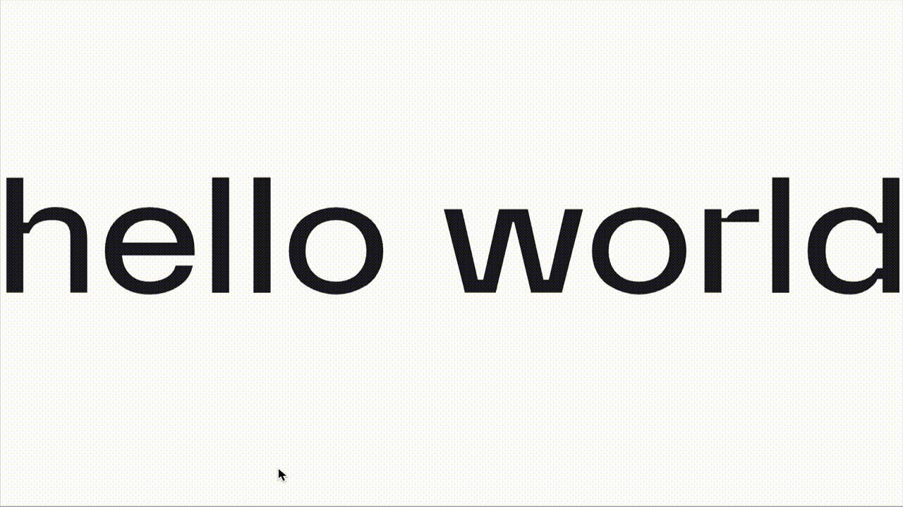

# 📘 Pixelated Title Card

> A WebGL-based pixelated text effect using Three.js and custom shaders.

---

## 🖼 Preview




---

## ⚙️ Getting Started

These instructions will get the project running locally.

```bash
# 1. Clone the repo
git clone https://github.com/yourname/pixelated-title-card.git

# 2. Navigate into the project folder
cd pixelated-title-card

# 3. Install dependencies
npm install   # if you’re using a bundler (e.g. Vite)

# 4. Run the app
npm run dev   # or open index.html directly if no bundler
```

> Built with:  
> - [Three.js](https://threejs.org/)  
> - Vanilla JavaScript (ES Modules)  
> - Plain CSS for layout and styling

---

## ✨ Features

- ✅ **Custom Shader Texturing**: Pixelation ripple driven by mouse movement  
- 🔁 **Responsive Canvas**: Auto-resizes and redraws on window resize  
- 💾 **Modular Class**: `PixelatedTextEffect` as a drop-in JS module  
- 🌗 **Font-Load Safe**: Waits for custom fonts before initial render  

---

## 💡 Dev Notes

- Uses `document.fonts.ready` to prevent fallback font rendering  
- Canvas background is set to black and text to white for high contrast  
- Shader grid resolution is 40×40, adjustable within the fragment shader  
- Overlay helper `applyPixelatedTextTo(selector)` for easy DOM integration  

---

## 📚 Inspiration / Credits

This effect was inspired by:

-
- WebGL shader tutorials and Three.js examples  

---

## 🧪 Known Issues

- ❌ First-load flash if fonts are slow to load on very cold caches  
- 🔍 Performance may dip on low-end devices due to full-screen canvas redraws  

---

## 🔭 Roadmap / TODO

- [ ] Expose grid resolution and distortion strength as component options  
- [ ] Add fallback `<h1>` text hidden behind canvas for improved accessibility  
- [ ] Package as an NPM module for easy import into other projects  

---

## 📂 Folder Structure

```bash
pixelated-title-card/
├── index.html
├── script.js             # Exports PixelatedTextEffect and applyPixelatedTextTo
├── styles.css
├── assets/
│   └── fonts
└── README.md
```

---

## 📜 License

MIT — feel free to use and adapt!

---

## 🙋‍♀️ Author

Made with ☕ + 🎧 by [suzubu](https://github.com/suzubu)  
